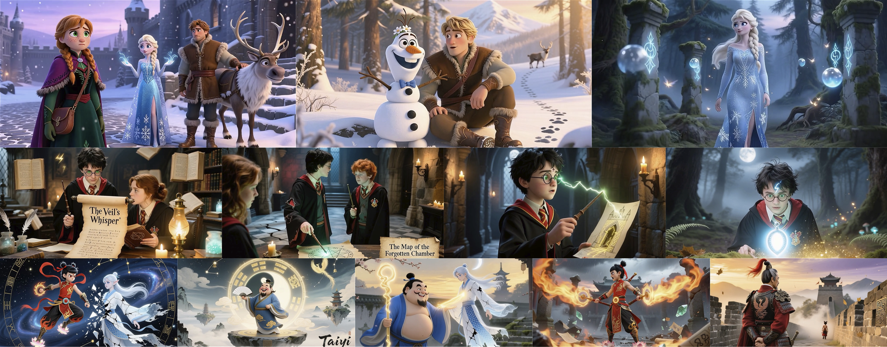

# 🎬 DramaAgent: Agentic Storytelling Video Generation

This repository contains the implementation of the paper:

> **DramaAgent: Agentic Storytelling Video Generation**
>
> [Ting Huang](https://github.com/Believeht029)\*, [Biao Wu](https://scholar.google.com/citations?user=Y3SBBWMAAAAJ&hl=en)\*, Ronghao Chen\*, [Zeyu Zhang](https://steve-zeyu-zhang.github.io/)<sup>†</sup>, Tengfei Cheng, Qizhen Lan, Huacan Wang, and [Hao Tang](https://ha0tang.github.io/)<sup>‡</sup>
>
> Peking University · UTS AAII · UOL · UTHealth Houston · UCAS
>
> \*Equal contribution. <sup>†</sup>Project lead. <sup>‡</sup>Corresponding author.
>
> ***AACL-IJCNLP 2026***
>
> ### [Paper]() | [Website](https://aigeeksgroup.github.io/DramaAgent/)

## ✏️ Citation

If you find our code or paper helpful, please consider starring ⭐ this repository and citing:

```bibtex
@misc{huang2026dramaagent,
  title={DramaAgent: Agentic Storytelling Video Generation},
  author={Huang, Ting and Wu, Biao and Chen, Ronghao and Zhang, Zeyu and Cheng, Tengfei and Lan, Qizhen and Wang, Huacan and Tang, Hao},
  year={2026}
}
```

---

## 🏃 Intro DramaAgent

DramaAgent coordinates story planning, persistent character conditioning, and reflection-guided repair to generate coherent long-form audiovisual stories over heterogeneous generation backbones.

Producing a complete story requires consistent characters, connected events, and compatible audio across many short clips. Independent clip generation can introduce narrative drift, identity changes, discontinuous transitions, and mismatched dialogue. DramaAgent addresses these challenges through an upper-level control framework that maintains reusable story and character state throughout generation.

Given a narrative prompt, the framework expands and decomposes the story into ordered scene targets, constructs canonical character references, and generates multiple candidates for each scene. A reflective evaluator scores identity consistency, semantic fidelity, temporal continuity, and audiovisual compatibility. Low-scoring scenes receive targeted repairs before the selected clips and audio tracks are composed into the final story.




### Core Components

- **Hierarchical story planning:** Convert a narrative into ordered events with participating characters, environments, emotions, transitions, and timed dialogue.
- **Persistent character conditioning:** Reuse canonical character references throughout generation, evaluation, and repair.
- **Reflection-guided repair:** Diagnose the weakest evaluation dimension and selectively regenerate the affected scene while retaining the best candidate.
- **Scene-aware audio and composition:** Assign speaker voices, align dialogue windows, mix ambience and music assets, and assemble selected clips with subtitles.

## TODO List

- [x] Implement structured story planning and input validation.
- [x] Implement persistent character references and cross-scene state.
- [x] Implement candidate selection and targeted repair with the paper's default settings.
- [x] Add audio composition, subtitle export, and checkpoint recovery.
- [x] Add MA2 data migration and configurable backend interfaces.
- [x] Add unit tests that do not call models or external services.

## 📦 Data Preparation

The pipeline accepts a narrative text file, a legacy MA2 synopsis, or a complete structured story. Example inputs are provided in [examples](examples/).

| Input | Example | Description |
|---|---|---|
| Narrative prompt | [prompt.txt](examples/prompt.txt) | Plain-text story idea or narrative |
| MA2 synopsis | [ma2_synopsis.json](examples/ma2_synopsis.json) | `MovieScript` and `Character` fields |
| Structured story | [story.json](examples/story.json) | Explicit character definitions and ordered scenes |

Each character has a stable `id`, `name`, and `appearance`. An optional `reference` points to an existing image, resolved relative to the input JSON file. Each scene specifies its environment, emotion, transition, participating characters, duration, and dialogue time windows.

Validate a structured story without loading a model:

```bash
python3 -m drama_agent validate --input examples/story.json
```

### Import Existing MA2 Storyboards

Convert an original `Step_3_shot_results.json` file using an explicit character sheet:

```bash
python3 scripts/import_ma2.py \
  --shots /path/to/Step_3_shot_results.json \
  --characters /path/to/character_sheet.json \
  --output /path/to/imported_story.json
```

The character sheet contains a `characters` list matching the original names, with the same structure as the example story. Supply actual appearance descriptions and reference paths. The importer preserves natural numeric ordering across sub-scripts, scenes, and shots. Legacy subtitles receive equal time windows because the original format has no timestamps; review dialogue length before generation.

## ⚙️ Environment Setup

The controller requires **Python 3.10+** and has no third-party Python dependencies. Install the command-line entry point from the repository root:

```bash
python3 -m pip install -e .
```

You can also use `python3 -m drama_agent` directly without installation. **FFmpeg and FFprobe** must be available on `PATH` for media processing.

Model dependencies belong in separate backend environments. The optional CogVideoX worker uses a CUDA environment and [requirements-gpu.txt](requirements-gpu.txt); importing the controller does not load a model or download weights.

## 🚀 Usage

The commands below are entry points for later execution. Implementation checks did not start training or real model inference. See [assessment and audio scope](#assessment-and-audio-scope) for the current validation boundaries.

### Backend Configuration

| Backend | Purpose | Configuration |
|---|---|---|
| `dashscope` | Qwen character images, Wan text-to-video, and LLM/VLM planning and assessment | [dashscope.example.json](configs/dashscope.example.json) |
| `command` | Existing model services or independent GPU workers | [Backend protocol](docs/backends.md) |
| `demo` | Synthetic placeholder video, test-tone audio, and fixture scores | [demo.json](configs/demo.json) |

For DashScope, replace the workspace URL in the example configuration, verify region and model access, and set `DASHSCOPE_API_KEY` in your environment. Configure speaker voices and any required `ambience_assets` / `music_assets`, or provide an external audio backend.

The built-in Wan adapter uses **textual identity constraints with text-to-video generation**. Image-conditioned backbones can be connected through a `video` command. The optional [CogVideoX adapter](scripts/cogvideox_backend.py) requires a scene keyframe mapping and a separate CUDA environment.

### Stage 1: Story Planning

Generate a structured story from a narrative prompt:

```bash
python3 -m drama_agent plan \
  --input examples/prompt.txt \
  --config configs/dashscope.example.json \
  --output outputs/story.json
```

A real backend calls a language model for this step. Existing structured stories bypass planning and are validated directly.

### Stage 2: Scene Generation and Targeted Repair

After configuring the required services and audio resources:

```bash
python3 -m drama_agent run \
  --input examples/story.json \
  --config configs/dashscope.example.json \
  --output outputs/story_run
```

The default reflection settings follow the paper:

| Parameter | Default |
|---|---:|
| Identity consistency weight | 0.35 |
| Semantic fidelity weight | 0.30 |
| Temporal continuity weight | 0.20 |
| Audiovisual compatibility weight | 0.15 |
| Acceptance threshold | 0.80 |
| Minimum score improvement | 0.02 |
| Maximum repair rounds per scene | 2 |
| Initial candidates per scene | 3 |

Each repair round generates one candidate for the weakest dimension. The best result is retained across rounds. Repair stops when the acceptance threshold is reached, improvement falls below 0.02, or the repair budget is exhausted.

For scenes that remain below threshold, `low_score_policy=keep_best` retains the best result and records `accepted=false`; `fail` saves the state and stops the run.

### Resume an Interrupted Run

Use the same input, configuration, and output directory:

```bash
python3 -m drama_agent run \
  --input examples/story.json \
  --config configs/dashscope.example.json \
  --output outputs/story_run \
  --resume
```

Video, audio, and assessment are saved separately. Recovery reuses completed stages and resumes polling saved asynchronous task IDs. Changed inputs or configurations, missing artifacts, and inconsistent cached scores cause an error.

### Outputs

```text
outputs/story_run/
  story.json                 # Validated story plan
  characters.json            # Persistent character bank
  characters/                # Canonical references
  scenes/                    # Candidate requests, media, assessments, selections
  run.json                   # Configuration, provenance, and progress
  composition/
    final.mp4                # Selected audiovisual story
    subtitles.srt            # Dialogue subtitles
```

Composition follows the explicit scene selection order, normalizes media formats, and applies fades at scene boundaries. Subtitle offsets follow the scene durations. Short clips are padded with their final frame and long clips are trimmed; this does not recover missing narrative events.

### Checks Without Models

```bash
python3 -m unittest discover -s tests -v
python3 -m compileall -q drama_agent scripts
python3 -m drama_agent validate --input examples/story.json
```

Tests use mock providers and simulated service responses. They do not load models, run generation, train, or call external services. The `demo` backend is a separate synthetic pipeline check, and its outputs and scores must not be reported as model evaluation results.

### Assessment and Audio Scope

The built-in VLM assessor reads canonical references and sampled frames from the preceding and current clips. Its `audio_visual` score is a **visual pacing and audio-plan compatibility proxy**; it does not assess audio waveforms or establish full lip synchronization. Connect an `assess` command that consumes actual video and audio for complete multimodal evaluation.

Built-in speech uses fixed speaker voices through macOS `say` or a configured `speech_command`. External `audio` commands can connect multi-speaker TTS systems. Requested ambience and music require supplied assets or a custom backend. Real API integrations and the optional GPU worker still require validation in their target environments.

## 📂 Project Structure

```text
drama_agent/
  schema.py                  # Story, character, dialogue, and assessment contracts
  config.py                  # Default parameters and configuration validation
  prompts.py                 # Planning, reflection, and repair prompts
  pipeline.py                # Persistent state, selection, repair, and recovery
  media.py                   # Audio mixing, video composition, and subtitles
  legacy.py                  # MA2 storyboard conversion
  backends/                  # Command, DashScope, and synthetic providers
scripts/                     # MA2 import and optional CogVideoX worker
configs/                     # Example configurations
examples/                    # Supported input formats
tests/                       # Model-free unit tests
docs/                        # Backend protocol documentation
```

## 🌟 Star History

[](https://www.star-history.com/#AIGeeksGroup/DramaAgent&type=date&legend=top-left)

## 😘 Acknowledgement

We thank the authors of [MovieAgent](https://github.com/showlab/MovieAgent), [Qwen](https://github.com/QwenLM/Qwen), and [Diffusers](https://github.com/huggingface/diffusers) for their research and open-source tools.
